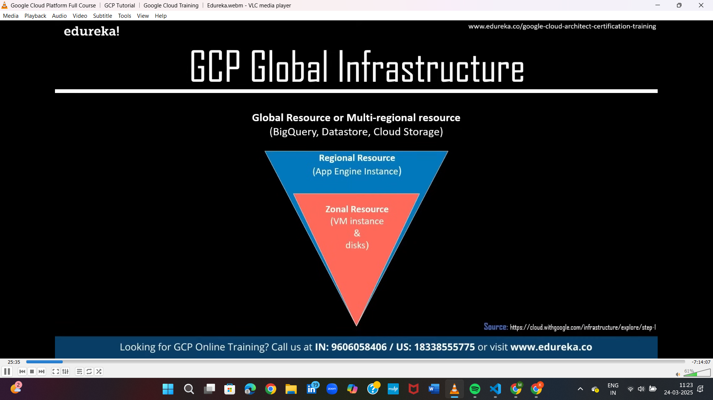
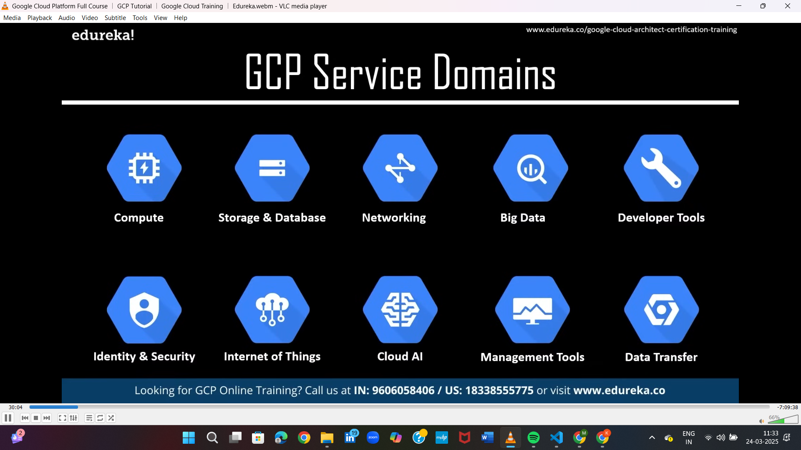
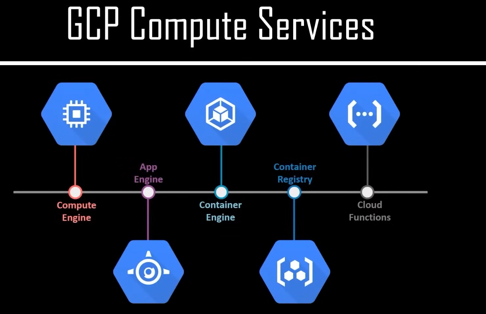
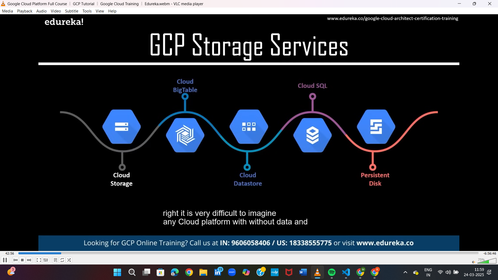
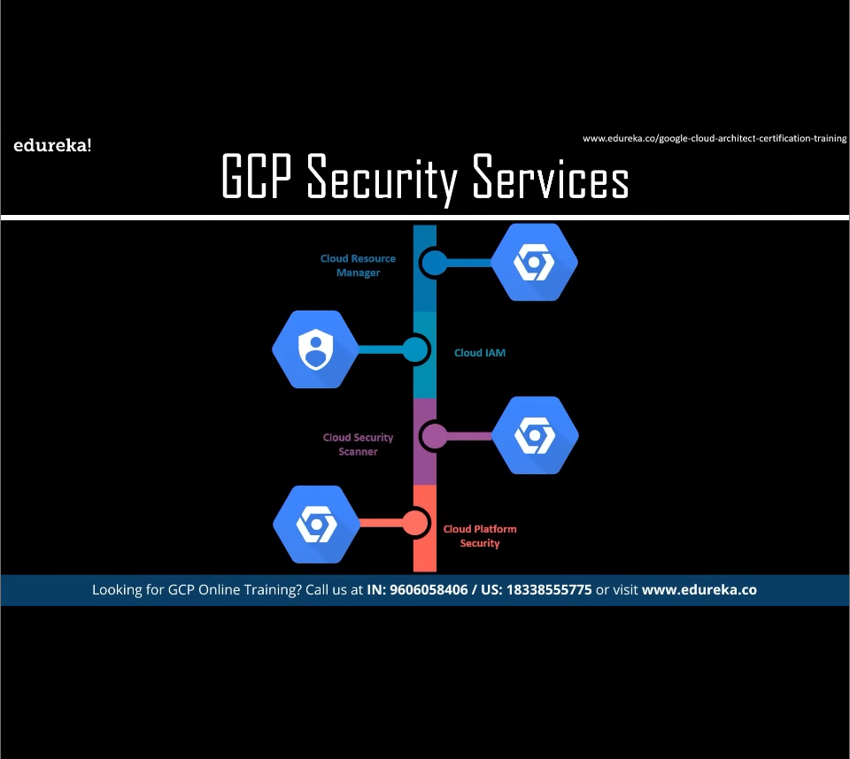
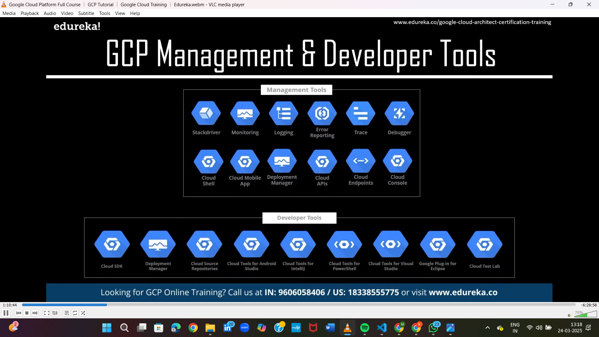
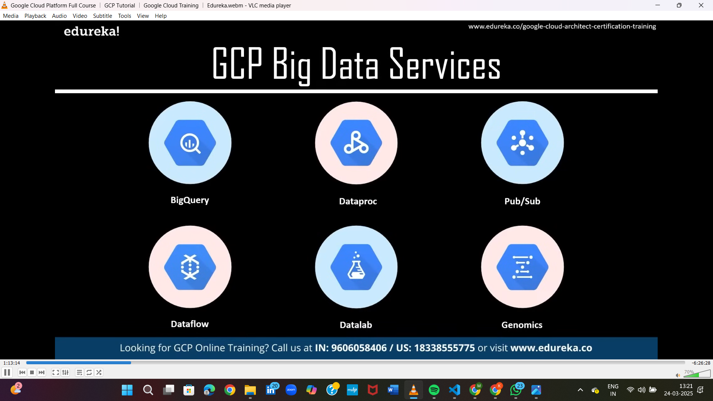
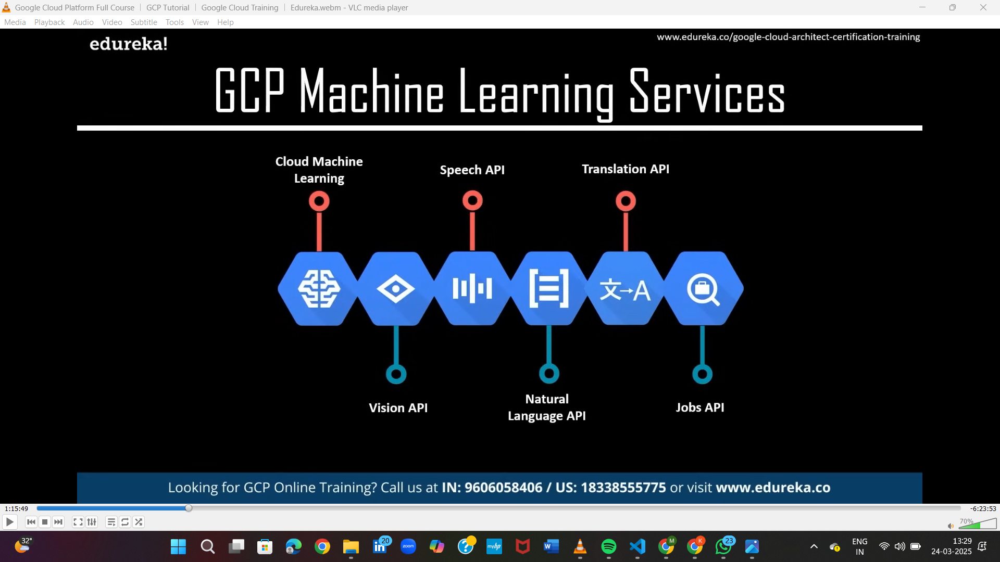

1.GCP GLOBAL INFRASTUCTURE 

2.GCP SERVICE DOMAINS

In this image, different GCP (Google Cloud Platform) service domains are shown. Here’s a simple explanation in Thanglish:

Compute

Virtual machines and containers run panna use pannura domain. Heavy applications and AI models ku useful.

Storage & Database

Data store, manage, and retrieve panna cloud storage options provide pannum. Both structured and unstructured data ku support irukum.

Networking

VPC (Virtual Private Cloud), Load Balancing, and DNS services maari secure network communication establish pannura services.

Big Data

Large datasets analyze panna and insights generate panna services. Data processing, real-time analytics, and machine learning ku best.

Developer Tools

Developers applications build and deploy panna helpful tools. Continuous integration and deployment (CI/CD) ku useful.

Identity & Security

User authentication, access management, and security monitoring provide pannum. Data and applications protect panna use pannalam.

Internet of Things (IoT)

IoT devices connect, monitor, and manage panna services. Real-time data collect and analyze panna use pannalam.

Cloud AI

AI and machine learning models train, build, and deploy panna solutions. Image recognition, natural language processing, and predictive analytics support irukum.

Management Tools

Infrastructure monitor and manage panna tools. Cost management, logging, and system health monitor panna helpful.

Data Transfer

On-premises to cloud or cloud-to-cloud data migrate panna use pannura services. Secure and fast data movement ku support pannum.

In short, GCP provides a wide range of services across these domains to meet various business and technological needs

3.GCP COMPUTE SERVICES

In this image, GCP (Google Cloud Platform) compute services are listed. Compute services are used for running applications, managing containers, and executing functions. Here's a brief explanation:

Compute Engine

Ithu virtual machines (VMs) provide pannum service. Heavy workloads, AI models, and large-scale applications run panna suitable.

App Engine

Fully managed platform. Web and mobile applications develop and deploy panna use pannalam. Auto-scaling and load balancing support irukum.

Container Engine

Kubernetes Engine maari containers manage panna use pannura service. Microservices-based applications ku best choice.

Container Registry

Ithu container images store, manage, and deploy panna use pannalam. Containerized applications ku secure storage provide pannum.

Cloud Functions

Event-driven service. Serverless applications run pannurathuku helpful. Example: File upload aana udan notification send panna mudiyum.

Overall, GCP compute services flexible, scalable, and reliable solutions provide pannudhu for different application needs.

4.GCP STORAGE SERVICES

Cloud Storage

Ithula object storage provide pannuvaanga. Images, videos, and backups maari unstructured data store panna use pannalaam.

Cloud BigTable

Large-scale structured data store panna use pannura service. Time-series data, financial data, and IoT data maari big data applications ku suitable.

Cloud Datastore

NoSQL database service. Mobile and web applications ku best choice. Efficent-a data query and retrieval panna use aagum.

Cloud SQL

Relational database management system (RDBMS). MySQL, PostgreSQL, and SQL Server support pannum. Traditional applications ku suit aagum.

Persistent Disk

Virtual disk storage. Compute Engine instances ku direct attach pannitu block storage maari use panna mudiyum. Snapshots and backups ku helpful.

Each storage type specific use cases ku design pannirukanga. Cloud-based data management la flexibility and scalability provide pannudhu GCP oda storage services intha madri.

5. GCP NETWORK SERVICES

Cloud Virtual Network - GCP-la virtual network create panna use pannuvanga. It connects resources like VM instances, databases, etc., within a private network.

Cloud Load Balancing - Traffic-ah balance panna use aagum. Multiple servers irundha, request-ah distribute panni performance improve pannum.

Cloud CDN (Content Delivery Network) - Static content like images, videos, and websites fast-ah deliver panna help pannum using global servers.

Cloud DNS (Domain Name System) - Website domain names-ah IP address-ku map pannum. Fast and reliable DNS service provide pannum.

6.GCP SECURITY SERVICES

Cloud Resource Manager - GCP-la resources (projects, folders, organizations) manage panna use pannuvanga. Ownership and access control establish panna helpful.

Cloud IAM (Identity and Access Management) - Users and roles manage pannurathukku ithu use aagum. Permissions control panna secure method.

Cloud Security Scanner - Web applications vulnerabilities (e.g., cross-site scripting, outdated libraries) detect panna scan pannum.

Cloud Platform Security - Overall platform security provide pannum with network protection, threat detection, and compliance management.

7.GCP MANAGEMENT & Developer TOOLS

8.GCP BIG DATA SEVICES

BigQuery - Large datasets-ku fast-a query panni analyze panna use pannuvanga. Structured and semi-structured data-ku best suited.

Dataproc - Hadoop, Spark, and other big data frameworks run panna scalable and managed service.

Pub/Sub - Real-time message streaming-ku use pannuvanga. Multiple applications communication-ku useful.

Dataflow - Stream and batch data processing-ku use aagum. Continuous data pipelines create panna help pannum.

Datalab - Interactive data analysis and machine learning experiments conduct panna use pannuvanga. Python, Jupyter Notebook support pannum.

Genomics - Genetic data analysis and processing-ku use aagum. Scientific research and healthcare domain-la widely used.

9.GCP MACHINE LEARNING SERVICES

Cloud Machine Learning - Pre-built and custom machine learning models create and train panna use aagum. Large-scale data processing support pannum.

Vision API - Images analyze pannurathukku use pannuvanga. Object detection, image labeling, face recognition, and text extraction support pannum.

Speech API - Speech-to-text conversion panna use aagum. Real-time speech recognition and voice analysis pannum.

Translation API - Multilingual text translate panna use aagum. 100+ languages support pannum.

Natural Language API - Text analyze panna, sentiment analysis, entity recognition, and content classification provide pannum.

Jobs API - Job search and talent management optimize panna use aagum. Recruitment companies and job boards-la ithu use pannuvanga.